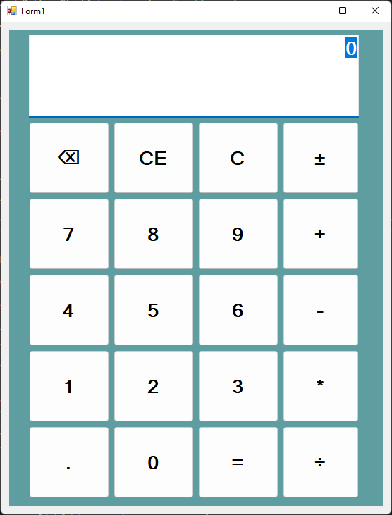

# Example

# Reporte de Usabilidad

| Heurística | Puntaje (1-5)| Descripcion
|--|:--:|--|
| No. CC-HE-01 - Visibiliadd del Estdo del Sistema | 1 | No contiene ningun indicador del estado del sistema
| No. CC-HE-02 - Coincidencia entre el sistema y el mundo real | 5 | Presenta semejanzas en los iconos con el mundo real
| No. CC-HE-03 - Dale al usuario el control y la libertad | 4 | Tiene comandos para rehacer y editar operaciones
| No. CC-HE-04 - Coincidencia y estándares | 5 | Se utilizaron los íconos estándar de una calculadora
| No. CC-HE-05 - Prevención de errores | 1 | No previene ningún error
| No. CC-HE-06 - Reconocer en lugar de recordar | 5 | El diseño es minimalista pero no aumenta la carga mental del usuario
| No. CC-HE-07 - Flexibilidad y eficiencia de uso | 2 | La interfaz no es flexible ni modificable pero es útil para todos los usuarios
| No. CC-HE-08 - Estética y diseño minimalista | 5 | Posee un diseño minimalista
| No. CC-HE-09 - Ayuda al usuario a reconocer, diagnosticar y recuperarse de los errores | 1 | No hay ninguna señal de error
| No. CC-HE-10 - Ayuda y documentación | 1 | No hay documentacion sobre el programa
